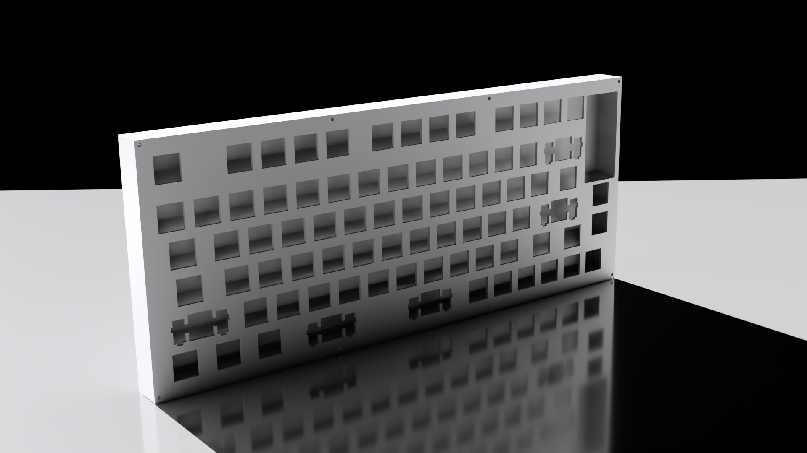
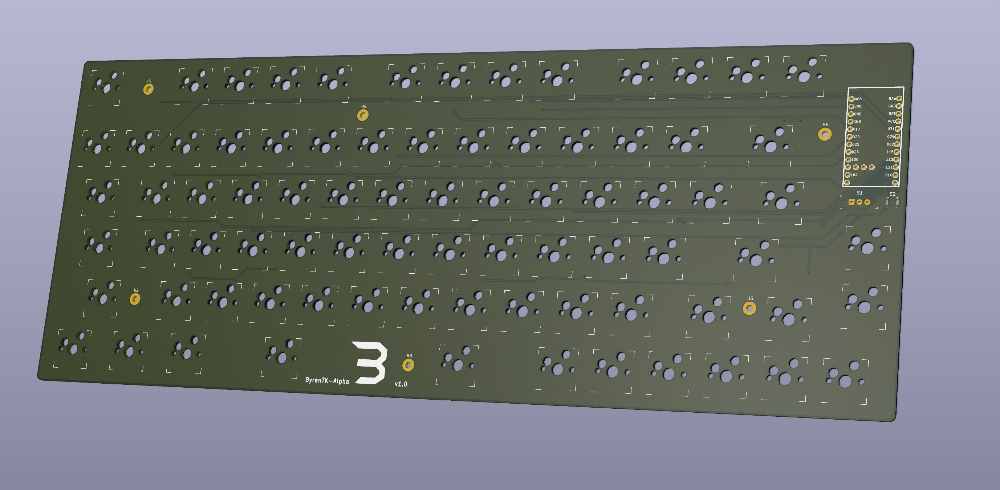

# ByranTK-Alpha

*The ByranTK-Alpha is an 80 key custom mechanical keyboard, designed to be made with any material.*
 
 
*"All the keys you need and no more."*

### V1.1 is confirmed to be working with firmware from https://github.com/Hello9999901/zmk-btk-alpha

# What is it:
The ByranTK-Alpha is an ongoing open-source keyboard project. It is extremely simple and utilizes a nice!nano from Nice Keyboards as the microcontroller. The battery life is estimated to be around 3 months of continuous useage (varies extremely depending on battery capacity). The keyboard is designed in KiCAD and FreeCAD, with the renders made with Blender.

# Features:
 - ZMK Firmware
 - Pro Micro Form Factor *
 - Wireless First
 - Split Spacebar
 - Low Profile (relative to other keyboards)
 - Hotswap Sockets
 - South facing (supports cherry profile)
 - Exploded 75% (ish) layout
 - Highly Customizeable

# Why?
Because nobody has done such thing yet. I have always wanted a simple-looking, customizeable (software-wise and hardware-wise), exploded 75% layout keyboard. In addition, it had to be under a certain price point. I estimate for it to cost less than 200 dollars for all the parts and all the machining, though that is subject to change.

# Image Gallery
(subject to change as design alters)

# License
Unless stated otherwise, the parts are licensed under the MIT Licesnse. Parts that are identified as (GPL) are licensed under the GPLv3 License.

\* The nice!nano v2 is used in this design. It has 3 extra pins in the center of the PCB, one of which the ByranTK-Alpha utilizes
