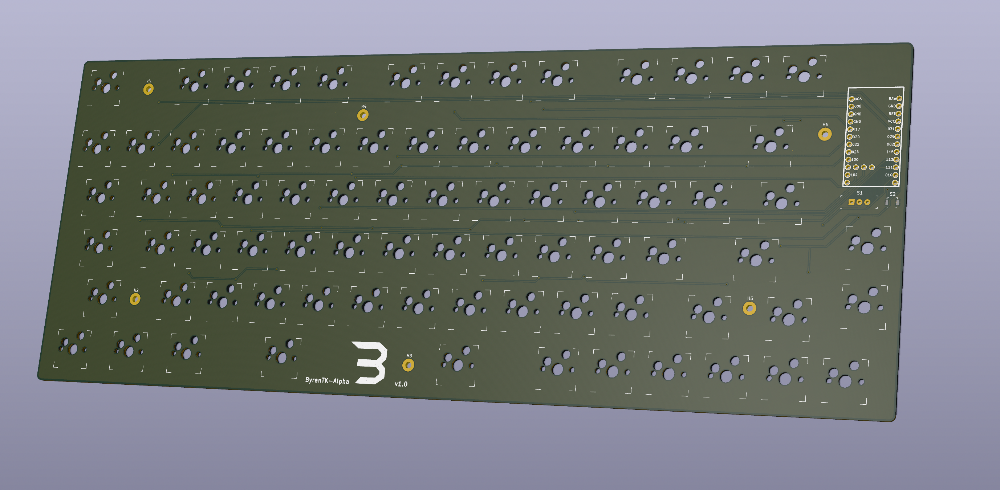

# ByranTK-Alpha

## The ByranTK-Alpha is an 80 key custom mechanical keyboard, designed to be made with aluminum. It has, as I like to say "every key you want, none of the keys you don't"

# Features:
 - ZMK Support
 - Pro Micro Form Factor*
 - Wireless First
 - Split Spacebar
 - Low Profile
 - Hotswap
 - Exploded 75% (ish) layout
 - Customizeable

# License
Unless stated otherwise, the parts are licensed under the MIT Licesnse. Parts that are identified as (GPL) are licensed under the GPLv3 License.

* The nice!nano v2 is used in this design. It has 3 extra pins in the center of the PCB, one of which the ByranTK-Alpha utilizes
